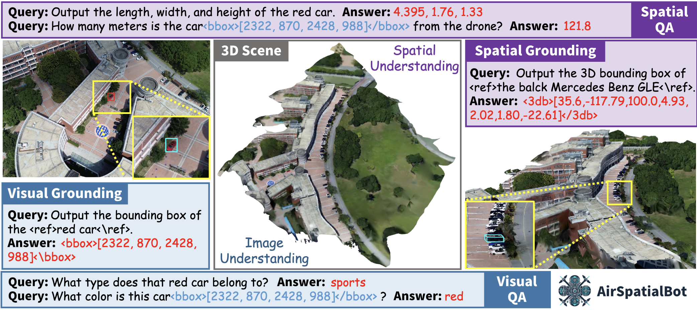
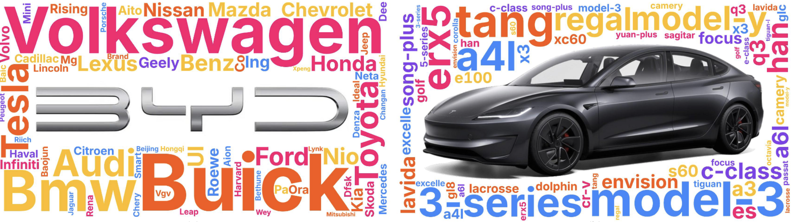
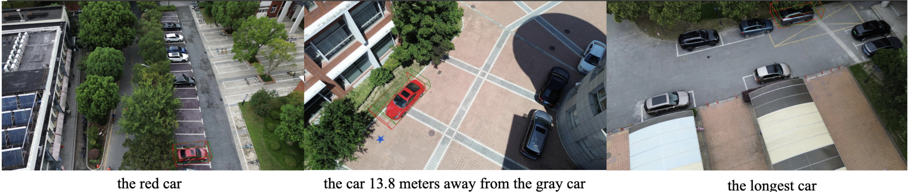
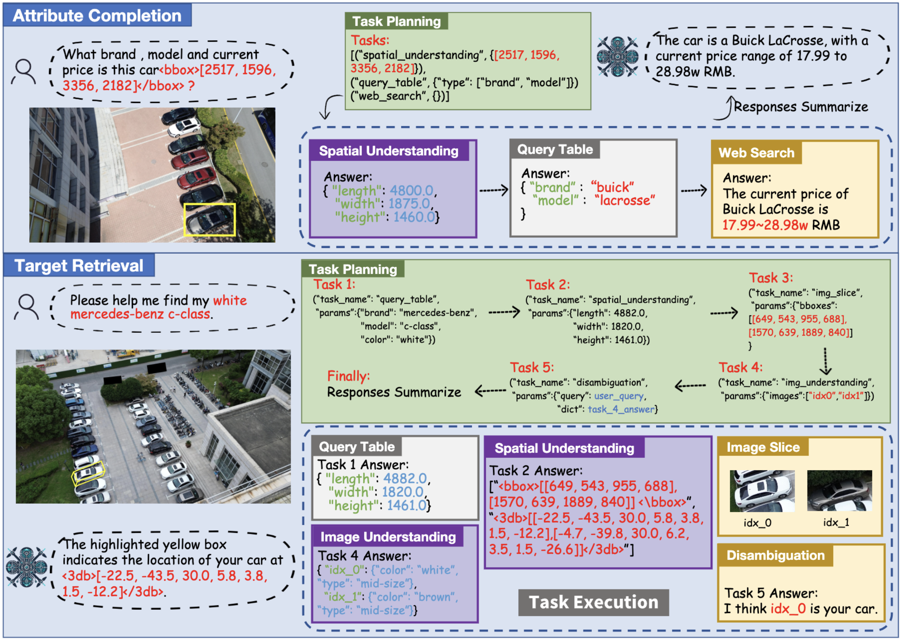

<div align="center">
<h1>AirSpatialBot: A Spatially-Aware Aerial Agent for Fine-Grained Vehicle Attribute Recognization and Retrieval</h1>

<div>
    <a href='https://zytx121.github.io/' target='_blank'>Yue Zhou</a>&emsp;
    Ran Ding&emsp;
    <a href='https://yangxue.site/' target='_blank'>Xue Yang</a>&emsp;
    <a href='https://ee.sjtu.edu.cn/FacultyDetail.aspx?id=53&infoid=66' target='_blank'>Jiang Xue</a>&emsp;
    <a href='https://www.researchgate.net/profile/Xingzhao-Liu/' target='_blank'>Xingzhao Liu</a>&emsp;
</div>
<div>
    Shanghai Jiaotong University&emsp; 
</div>

[](https://ieeexplore.ieee.org/document/11006099)


</div>

<p align="center">
    
</p>

---

## 📢 Latest Updates


- This repository has been migrated to a new [address](https://github.com/VisionXLab/AirSpatialBot). Please refer to the new location for future updates.

---

## Abstract

*Despite notable advancements in remote sensing vision-language models (VLMs), existing models often struggle with spatial understanding, limiting their effectiveness in real-world applications. To push the boundaries of VLMs in remote sensing, we specifically address vehicle imagery captured by drones and introduce a spatially-aware dataset AirSpatial, which comprises over 206K instructions and introduces two novel tasks: Spatial Grounding and Spatial Question Answering. It is also the first remote sensing grounding dataset to provide 3DBB. To effectively leverage existing image understanding of VLMs to spatial domains, we adopt a two-stage training strategy comprising Image Understanding Pre-training and Spatial Understanding Fine-tuning. Utilizing this trained spatially-aware VLM, we develop an aerial agent, AirSpatialBot, which is capable of fine-grained vehicle attribute recognition and retrieval. By dynamically integrating task planning, image understanding, spatial understanding, and task execution capabilities, AirSpatialBot adapts to diverse query requirements. Experimental results validate the effectiveness of our approach, revealing the spatial limitations of existing VLMs while providing valuable insights.*

<div align="center">
  
  <div style="display: inline-block; color: #999; padding: 2px;">
      AirSpatialBot’s Visual Understanding and Spatial Understanding Capabilities.
  </div>
</div>

---

## 🏆 Contributions

- **New Tasks and Dataset.** We introduce AirSpatial, a spatially-aware dataset featuring two novel tasks: Spatial
Grounding (SG) and Spatial Question Answering (SQA). It is the first RS grounding dataset to provide 3DBB, which will lead critical role of spatial understanding in RS VLMs.

- **Spatially-aware VLM.** We propose a two-stage training strategy, pre-training on 2D RSVG datasets and fine-tuning with AirSpatial to enhance spatial understanding. To facilitate 2D-to-3D knowledge transfer, we introduce ASL, while GML ensures 3D spatial consistency.


- **Aerial Agent.** We develop AirSpatialBot, an aerial agent that utilizes our spatially-aware VLM for fine-grained vehicle attribute recognition and retrieval, making it the first approach capable of identifying vehicle brands, models, and pricing information from aerial imagery.

---

## 💬 AirSpatial Dataset

Word cloud visualizations of vehicle occurrence frequencies in our dataset. (a) shows the brand word cloud, where BYD ranks first. (b) illustrates the model word cloud, with Tesla Model 3 ranking first.
<p align="center">
  
</p>


---

## 🔍 Spatially-aware VLM

Visualizations of AirSpatialBot on AirSpatial-G with 3DBB. The green boxes indicate ground truth, while the red boxes represent predictions.

<p align="center">
  
</p>

---

## 🚀 Aerial Agent

Workflows for Vehicle Attribute Recognition, Zero-Shot Attribute Recognition and Target Retrieval Tasks.Planner

<div align="center">
  
</div>


## 📜 Citation
```bibtex
@ARTICLE{zhou2025airspatialbot,
  author={Zhou, Yue and Ding, Ran and Yang, Xue and Jiang, Xue and Liu, Xingzhao},
  journal={IEEE Transactions on Geoscience and Remote Sensing}, 
  title={AirSpatialBot: A Spatially-Aware Aerial Agent for Fine-Grained Vehicle Attribute Recognization and Retrieval}, 
  year={2025},
  volume={},
  number={},
  pages={1-1},
  doi={10.1109/TGRS.2025.3570895}
}
```
